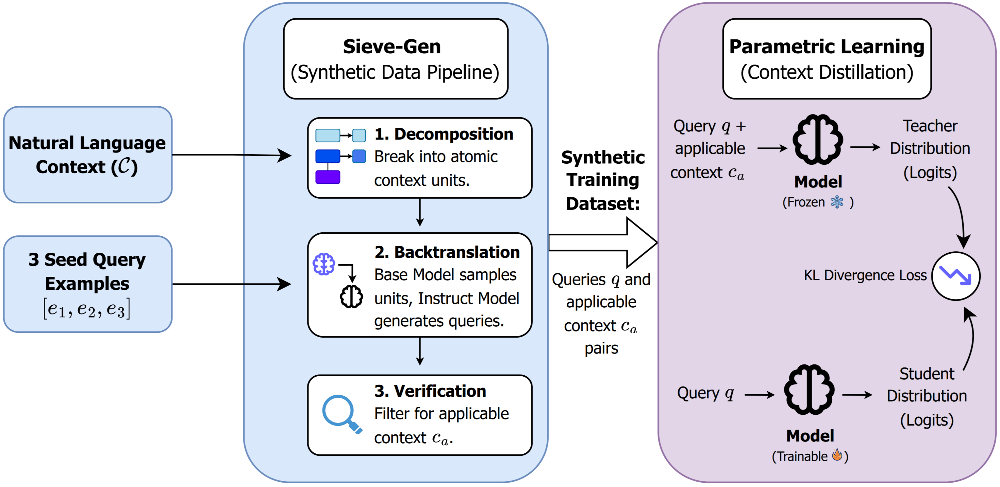

# SIEVE: Sample-Efficient Parametric Learning from Natural Language

📜 **Paper**: https://pgasawa.github.io/sieve

<p align="center">
  
</p>

**SIEVE** enables sample-efficient parametric learning from natural language using as few as 3 query examples. 

Real-world learning rarely comes with query distributions or expert traces—you typically have natural language context and maybe a handful of examples. SIEVE's key insight: context is decomposable. Not all context applies to every query.

SIEVE decomposes context into atomic units, generates diverse synthetic queries, and filters to pair each query with only its applicable context. This produces higher-quality training data for distilling knowledge into model weights—enabling persistent improvements without context at inference time.

**Results:** SIEVE outperforms prior context distillation methods (even when given real data) and matches or exceeds in-context learning baselines across reasoning tasks.

---

## Installation

This project uses [uv](https://github.com/astral-sh/uv) for dependency management:

```bash
uv sync --extra gpu
```

---

## Quick Start

SIEVE operates in three main steps:

### 1. Generate Synthetic Queries
Create diverse queries from natural language feedback using SIEVE-GEN:

```bash
bash scripts/examples/01_synthetic_query_gen.sh
```

This uses a base model and instruction model to:
- Decompose natural language context into context units
- Generate thousands of diverse synthetic queries
- Select applicable context for each query

### 2. Prepare Soft Distillation Data
Generate teacher token distributions (top-k logits) for training:

```bash
bash scripts/examples/02_soft_distillation_data_gen.sh
```

### 3. Train via Soft Distillation
Train the student model to internalize the teacher's behavior:

```bash
bash scripts/examples/03_soft_distillation_training.sh
```

---

## Advanced Usage

### Custom Domains

To adapt SIEVE to your domain:

1. **Create feedback/context**: Write natural language guidelines (see `retail/`, `mtob/`, `rule_arena/` for examples)
2. **Prepare seed examples**: Provide 3+ example queries
3. **Subclass `SyntheticDataGenerator`**: Implement domain-specific query generation logic
4. **Run the pipeline**: Use the three-step process above

---

## Requirements

- Python 3.13+
- CUDA-compatible GPUs (for training and vLLM inference)
- 80GB+ GPU memory recommended (or use DeepSpeed ZeRO-3 across multiple GPUs)

---

## 📜 License

**SIEVE** is Apache 2.0 licensed, making it suitable for both academic and commercial use.

---

## 📧 Contact

Please feel free to reach out at pgasawa@berkeley.edu!

---

## 📋 Citation

```text
@article{asawa2026sieve,
  title={SIEVE: Sample-Efficient Parametric Learning from Natural Language},
  author={Parth Asawa and Alexandros G. Dimakis and Matei Zaharia},
  year={2026},
} 
```