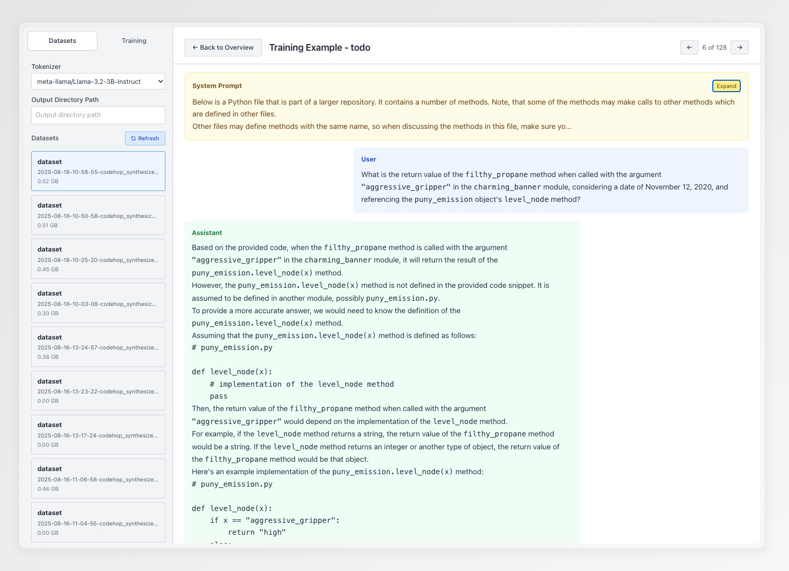

# A simple dashboard for data inspection and debugging

We (heavily-assisted by Claude Code) implemented a handy-dandy tool for visualizing the synthesized dataset. We've found this very useful for debugging and improving the self-study process. It provides a simple dashboard where you can select a dataset and inspect each synthesized conversation.

We encourage you to adapt the interface to your needs, we've found Claude Code to be very helpful in this process.

## Setup

**Note:** The following works for us with node --version `v24.4.0`. If you're running into issues installing dependencies, or with the frontend, try using this version.

1. Install the dependencies:
```bash
cd viz
pip install -r requirements.txt
npm install
```

2. Start the server:
```bash
uvicorn src.server:app --host 0.0.0.0 --port 8001 --reload 
```
If your data is on a remote machine, you need to start the server on the remote, forward the port to your local machine, and run the frontend on your local machine due to CORS issues.

You may need to pick a different port if the default 8001 is already in use.

3. Start the frontend:
Make sure to set the `VITE_API_TARGET` to the port of the server.

```bash
VITE_API_TARGET=http://localhost:8001 npm run dev
```

---





