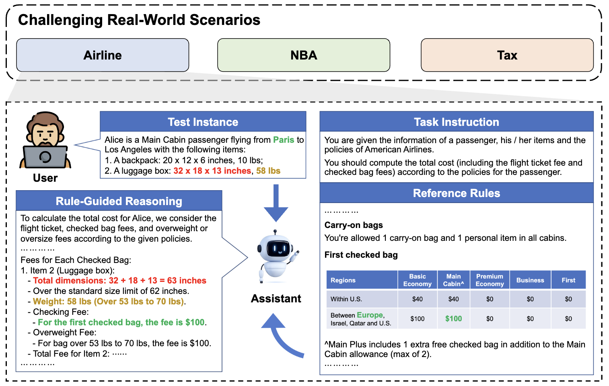

# RuleArena [ACL 2025]

Dataset and code for our ACL 2025 paper "[RuleArena: A Benchmark for Rule-Guided Reasoning with LLMs in Real-World Scenarios](https://arxiv.org/abs/2412.08972)".

## Introduction

RuleArena is a challenging benchmark to evaluate LLMs on rule-guided reasoning tasks from real-world scenarios:
* **Airline:** Calculate the total cost for passengers, including their flight ticket and checked baggage fees.
* **NBA:** Determine whether one or more specified transactions (contract signing or trading) are allowed.
* **Tax:** Calculate the income tax for one person or family given their financial information.

<p align="center" style="adding-bottom: 10pt">
  </img>
</p>

LLMs are given a the task instruction, the reference rules in this scenario, and a user instance, and required to conduct reasoning and computation for the user input under the guidance of reference rules.

## Environment

* Run `pip install -r requirements.txt` to install critical dependencies. 
* Set your API keys as following in `~/.bashrc`, and run `source ~/.bashrc`:

```bash
export OPENAI_API_KEY="YOUR OPENAI API KEY"
export CLAUDE_API_KEY="YOUR CLAUDE API KEY"
export QWEN_API_KEY="YOUR QWEN API KEY"
```

* **If you want to use Vertex AI Llama API:** follow the instructions [here](https://cloud.google.com/sdk/docs/install) to setup Google Cloud API.

## How to Use

#### Main Results
Simply enter the domain ([`airline`](airline/), [`nba`](nba/), or [`tax`](tax/)) folder and run the evaluation script `auto_test.py`, and specify:
* The LLM (`--llm`) to evaluate
* The difficulty level (`--complexity`) of problems
* Whether to use 1-shot example (`--use_example`)

For example, to evaluate Claude-3.5 Sonnet (`claude-3-5-sonnet-20241022`) on Level-1 (medium difficulty) airline tasks with 1-shot example, do the following:
```bash
cd ./airline
python auto_test.py --llm claude-3-5-sonnet-20241022 --complexity 1 --use_example
```

#### Experiments for Different Rule Representation
To run rule representation experiments, add `--textual` to convert tabular rules into textual rules when running airline and tax evaluations at difficulty level 0 like:
```bash
cd ./airline
python auto_test.py --llm claude-3-5-sonnet-20241022 --complexity 0 --use_example --textual
```

#### Experiments for Distractive Rules
To run distractive rule experiments, add `--distractor` or `--placeholder` to insert distractive rules or meaningless placeholder tokens when running tax evaluations at difficulty level 0 like:
```bash
cd ./tax
python auto_test.py --llm claude-3-5-sonnet-20241022 --complexity 0 --use_example --distractor
python auto_test.py --llm claude-3-5-sonnet-20241022 --complexity 0 --use_example --placeholder
```

***DO NOT use these two arguments together.***

#### Notes:
* The meanings of each parsable argument are written in comments.
* For LLMs except Llama, we use official APIs, for which you can refer to:
  - GPT-4o: [OpenAI API documents](https://platform.openai.com/docs/api-reference/introduction)
  - Claude-3.5 Sonnet: [Anthropic API documents](https://docs.anthropic.com/en/api/getting-started)
  - Qwen-2.5: [Qwen API documents](https://www.alibabacloud.com/help/en/model-studio/developer-reference/use-qwen-by-calling-api)
* Specifically, for Llama APIs you can refer to: [Vertex AI Llama API](https://console.cloud.google.com/vertex-ai/publishers/meta/model-garden/llama3_1?inv=1&invt=AbkkqQ&project=vast-art-443608-e4)

## Citation

Please consider citing our paper and giving us a star if you use RuleArena and find it interesting/helpful for your work, and we'd appreciate it! Feel free to contact [Ruiwen Zhou](mailto:skyriver@sjtu.edu.cn) or open an issue if you have any questions.

```
@inproceedings{zhou2025rulearena,
  author={Ruiwen Zhou and Wenyue Hua and Liangming Pan and Sitao Cheng and Xiaobao Wu and En Yu and William Yang Wang},
  title={RuleArena: A Benchmark for Rule-Guided Reasoning with LLMs in Real-World Scenarios},
  booktitle={Proceedings of the 63rd Annual Meeting of the Association for Computational Linguistics ({ACL})},
  year={2025}
}
```
